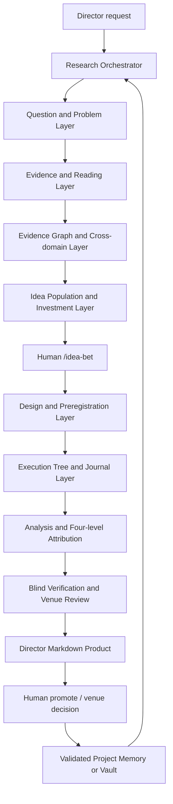

# AI Research Team 科研能力架构

> 版本：2026-07-10  
> 定位：面向真实科研产出的模型无关多 Agent 研究团队，而不是模型治理展示系统  
> 事实边界：本文同时描述“已经实现”“正在升级”“目标能力”。三者必须分开阅读，不能把路线图当成已运行结果。

## 1. 结论先行

这个系统的目标不是让很多 Agent 轮流写一段话，而是让一个科研问题经过以下可审计闭环：

```text
问题定义
  -> 多视角问题推进
  -> 来源检索与质量分层
  -> claim / exact span 归因
  -> 矛盾与反证搜索
  -> 机制图和跨域路径
  -> 假设群体生成、反思、比较、演化、重新查新
  -> 人类 /idea-bet
  -> estimand 与实验协议冻结
  -> 原子实验分支、真实执行 journal、失败归因
  -> 统计、因果边界、复现和盲审
  -> 决策级 Markdown
  -> 人类 promotion / venue gate
  -> 经过验证的跨运行学习
```

“科研强大”在这里有八个可检查的含义：

1. **问题挖掘强**：能区分已知事实、被忽略的已知、已知未知和未知未知，不把“没搜到”写成创新。
2. **阅读深**：能定位 claim、方法、公式、图表、数值、限制、复现材料及其在当前项目中的作用。
3. **归因严**：引用存在、语义支持、实验干预、失败根因和因果效应是不同层级，逐层加严。
4. **创新强**：通过机制图、非最短跨域路径、反证、类比适配和假设演化产生新方向，而不是关键词拼接。
5. **实验真**：区分“设计了脚本”“提交了运行”“运行完成”“结果可解释”“结论可复现”。
6. **反思有效**：refine loop 以新增证据、信息增益、未决风险和 kill 条件停止，不靠随意重试次数。
7. **产物可用**：最终给研究者看的主产物是完整 Markdown，不要求研究者阅读 JSON 才知道发生了什么。
8. **可升级**：Agent 写职责和能力合同；具体模型、供应商、reasoning 配置由运行环境绑定，不进入科研架构。

## 2. 外部系统调查后吸收什么

### 2.1 不复制某个项目，组合经过验证的机制

| 科研目标 | 吸收机制 | 来源 | RAT 中的落点 |
|---|---|---|---|
| 多视角问题推进 | perspective question tree、moderator、动态概念图 | [STORM / Co-STORM](https://github.com/stanford-oval/storm) | `deep_research`、`gap_breadth` |
| 全文证据 | search、gather evidence、query-conditioned context、citation traversal | [PaperQA2](https://github.com/Future-House/paper-qa) | evidence 与 paper reading |
| 长答案归因 | correctness、citation precision/recall/F1、coverage、反馈后补检 | [OpenScholar](https://github.com/AkariAsai/OpenScholar)、[ScholarQABench](https://github.com/AkariAsai/ScholarQABench) | citation attribution 与 Markdown eval |
| 全局到局部知识导航 | span-backed graph、community routing、local text unit、DRIFT | [Microsoft GraphRAG](https://github.com/microsoft/graphrag) | recall、evidence graph、跨域路径 |
| 跨域发现 | typed ontology、非最短路径、mechanism-design-experiment 链 | [SciAgents](https://github.com/lamm-mit/SciAgentsDiscovery) | `deep_ideation` |
| 假设演化 | generation、reflection、pairwise review、meta-review、evolve、dedup | [Open Coscientist](https://github.com/jataware/open-coscientist) | idea population loop |
| 实验树 | staged tree、branch journal、有限 debug、replication/ablation | [AI Scientist v2](https://github.com/SakanaAI/AI-Scientist-v2) | `full_rigor_minimal`、`tree_explore` |
| 原子变化 | parent-child 单一改动、draft/debug/improve、metric-guided pruning | [AIDE](https://github.com/WecoAI/aideml) | branch lineage 与 failure attribution |
| 研究与开发分离 | Researcher、Developer、Experiment Feedback、trace | [RD-Agent](https://github.com/microsoft/RD-Agent) | idea、execute、debug |
| 人机阶段门 | approve、repeat、note、resume checkpoint | [Agent Laboratory](https://github.com/SamuelSchmidgall/AgentLaboratory) | human gates 和断点恢复 |
| 跨运行积累 | 多 lab 异步共享历史工作 | [AgentRxiv](https://agentrxiv.github.io/) | 只吸收“验证记录可检索”，不共享生成论文 |
| 因果纪律 | model、identify、estimate、refute、GCM | [DoWhy](https://github.com/py-why/dowhy) | causal attribution |
| 因果发现 | PC/FCI/GES/LiNGAM、CPDAG/PAG、背景知识 | [causal-learn](https://github.com/py-why/causal-learn) | 只生成因果假设，不直接宣称真图 |
| 方法 SOP | 明确方法步骤、强制表格/图、known-trap eval | [Auto-Empirical-Research-Skills](https://github.com/brycewang-stanford/Auto-Empirical-Research-Skills) | Agent SOP 与业务 eval |

完整机器可读目录见：

`agents/references/research-systems/open-source-pattern-catalog.yaml`

### 2.2 明确拒绝吸收的坏模式

- 不以角色数量证明多 Agent 能力。
- 不让同一个 worker 生成 claim、链接证据、再宣布自己链接正确。
- 不把 LLM 自评分、Elo、paper reward 或 benchmark medal 当科学真值。
- 不把 community summary、context summary 或 perspective note 当可引用原始证据。
- 不把查无结果当 novelty，也不把标题/摘要相似度当 prior-art closure。
- 不把 runtime error 解释为假设失败。
- 不把普通 ablation、SHAP、feature importance、Granger correlation 写成机制因果。
- 不把 causal discovery 输出的 CPDAG/PAG 强制定向为“真实 DAG”。
- 不把 refuter 全部通过写成因果图已被证明。
- 不把脚本产出写成实验已运行。
- 不把生成论文或 Markdown 写成已经进入数据库。

## 3. 总体架构



控制平面只承担以下职责：

- 选择 mode 和阶段。
- 冻结输入和 worker 可见范围。
- 调度依赖关系明确的 worker。
- 执行确定性验证和停止规则。
- 保留 run 状态与可恢复断点。
- 渲染研究者可读的 Markdown。

控制平面不能代替科学判断，也不能仅凭 schema 合法就宣称科研质量高。

## 4. Agent 体量和类型

### 4.1 Agent 不是按模型名字定义

每个 Agent 只声明：

```yaml
role: independent-citation-auditor
scientific_duty: reopen exact source spans and judge semantic support
required_capabilities:
  reasoning: strong
  long_context: true
  tool_use: true
  visual_reading: conditional
  code_execution: false
independence:
  must_not_author: [claim_list, claim_evidence_map]
  frozen_inputs: [source_snapshot, claim_list, exact_locators]
output_contract: citation_audit/v1
failure_behavior: abstain_or_block
```

运行层再把能力合同映射到当时可用的模型。历史的 `opus` / `sonnet` 只作为工作负载兼容别名，不代表必须使用某个供应商。

### 4.2 六种 Agent 体量

| 类型 | 典型体量 | 用途 | 必须避免 |
|---|---:|---|---|
| Micro specialist | 单一窄任务 | 抽 claim、查一个公式、审一个 split | 扩大任务、自行综合 |
| Independent seat | 2-6 个互盲席位 | perspective、review、idea comparison | 看到其他席位结论后再假装独立 |
| Synthesizer | 1 个后置 worker | 聚合已完成的独立 bundle | 产生未被上游支持的新事实 |
| Manager | 1 个阶段调度角色 | 决定下一问题或分支 | 自行批准 bet、promotion、publish |
| Refiner | 有界循环 | 定向补检、修复、重新分析 | 反复改写到“看起来通过” |
| Memory curator | 后置角色 | 将验证结果写入项目记忆候选 | 把草稿写入 vault |

### 4.3 按任务规模确定最小团队

| 规模 | 最小结构 | 示例 |
|---|---|---|
| S0 工具性任务 | 1 producer + deterministic validator | 列项目、查状态、格式转换 |
| S1 轻科研任务 | source/producer + independent critic + synthesizer | `evidence_review` |
| S2 深科研任务 | 6-12 workers，至少 2 个互盲席位 | `evidence_deep`、`deep_research` |
| S3 核心科研任务 | 12-30 workers，跨阶段、独立复核、refine loop | `read_paper_deep`、`full_rigor_minimal` |

任何会改变研究方向、实验结论或论文主张的任务，不得退化为单 worker 自问自答。

## 5. 八个科研能力层

### 5.1 Question and Problem Layer

职责：把一个模糊方向变成可搜索、可反驳、可实验的问题集合。

Agent：

- `question-decomposer`：拆出对象、条件、干预、机制、结果和决策。
- `perspective-questioner`：按方法、数据、理论、失败、跨域等视角推进问题。
- `question-moderator`：检测重复、视角失衡、未解决矛盾和低新增证据。
- `mathematical-formalizer`：把问题转成变量、约束、目标和假设，不硬编码领域。

输出：

- `question-trace`
- `problem-abstraction`
- `concept-map`
- `unknown-register`

停止：必须覆盖预设问题维度；关键 claim 有证据或明确 unknown；连续两轮新增 span 和决策变化均低于阈值。预算耗尽只允许 `NEEDS_HUMAN`，不能伪装完成。

### 5.2 Evidence and Reading Layer

职责：建立来源质量分层、精确归因、矛盾与不确定性。

轻量流程：

```text
lit-scout
  -> [source-quality-ranker || claim-extractor]
  -> evidence-search-moderator
  -> claim-evidence-linker
  -> citation-coverage-auditor
  -> deterministic attribution gate
  -> Markdown brief
```

深度流程：

```text
source gathering
  -> source-quality ranking
  -> independent perspectives
  -> claim extraction
  -> exact-span linking
  -> independent semantic audit
  -> contradiction / staleness / dataset audit
  -> landscape synthesis
  -> Markdown brief
```

核心规则：

- 来源身份存在、locator 正确和语义支持分开报告。
- claim 必须原子化，保留条件、方向、数值、置信区间和适用范围。
- 每个严格 locus 绑定 snapshot、SHA-256、parser version、page/block/char/table/figure locator 和短 exact quote。
- 独立 auditor 重新打开 snapshot，不能相信 linker 的布尔值。
- citation correctness、claim completeness、citation F1 分开报告。
- 找不到支持时删除、降级或标记 unknown，不允许事后合理化引用。

### 5.3 Deep Paper Reading Layer

目标不是“总结论文”，而是回答：论文做了什么、证据支持到哪里、哪里可能错、对当前项目有什么影响。

最小深读席位：

1. blind second reader
2. pre-read planner
3. paper note extractor
4. structure mapper
5. project-context aligner
6. claim extractor
7. claim-evidence linker
8. independent citation-coverage auditor
9. method teardown
10. visual figure/table reader
11. result-table auditor
12. math/algorithm verifier
13. paper appraiser
14. relations mapper
15. trend mapper
16. domain-transfer critic
17. reproducibility-materials auditor
18. reconciliation/refine worker
19. quality auditor
20. Markdown writer

严格边界：

- blind second reader 首次只能看原 PDF/fulltext snapshot 和 task，不能看主分析。
- reconciliation 才能同时读取主分析与 blind read，形成 repair ledger。
- figure reader 必须获得页面 render/image 或明确标记 `UNREAD_VISUAL`。
- Markdown 正文覆盖由确定性 linter 直接读取正文检查，不能相信 writer 自报 `covered_*`。
- 单篇“读完”不等于多来源 evidence saturation；reading completeness 与 landscape saturation 分开。

### 5.4 Evidence Graph and Cross-domain Layer

Scratch-only 类型图：

```text
paper
  -> claim
  -> method
  -> mechanism
  -> assumption
  -> dataset
  -> intervention
  -> metric
  -> result
  -> failure
  -> constraint
```

每条边必须携带：

- source span
- edge type
- confidence
- observed / inferred 标记
- applicability boundary
- contradiction status

跨域不是关键词相似，而是寻找结构同构：

```text
target failure
  -> causal/mechanism primitive
  -> source-domain mechanism
  -> shared invariant
  -> broken assumption
  -> required adaptation
  -> falsifier
```

探索 2-4 hop 的非最短路径，随后必须重新检索、查新和设计最小判别实验。Graph community summary 只负责导航，不能成为引用。

### 5.5 Idea Population and Scientific Investment Layer

流程：

```text
gap dossiers
  -> independent proposal generation
  -> independent reflection
  -> AB/BA pairwise comparison
  -> prior-art prosecution
  -> evolve/recombine
  -> re-ground evolved ideas
  -> cheapest falsification plan
  -> scientific-investment ranking
  -> /idea-bet
```

每个 idea memo 必须包含：

- answerable research question
- mechanism hypothesis
- causal chain
- exact prior-art delta
- why now
- strongest rejection case
- cheapest decisive experiment
- baselines and controls
- success/failure thresholds
- kill criteria
- resource and data constraints
- staged ladder，例如 `oracle_upper_bound -> learned_model -> end_to_end`

主排序是 scientific investment，而不是 feasibility：

```text
scientific merit
  = importance
  + mechanism coherence
  + novelty exposure
  + falsifiability
  + expected information gain
  + downstream leverage

investment priority
  = scientific merit (major weight)
  + pairwise tournament
  + evidence grounding
  + falsification readiness
  + feasibility (minor weight)
```

排序是决策辅助，不是机器下注；`/idea-bet` 始终由人类执行。

### 5.6 Design and Execution Layer

设计必须冻结：

- research question and estimand
- population and experimental unit
- intervention and comparator
- outcome and metric direction
- splits and leakage controls
- randomization/order/pairing
- seeds and repetitions
- MDE/power or precision target
- analysis model and multiple testing
- interaction terms
- go/no-go/kill thresholds
- allowed variables and forbidden changes

执行树每条 parent-child 边只允许一个 atomic intervention：

```yaml
branch_id: B-12
parent_branch_id: B-07
hypothesis_ref: H-3
atomic_intervention: enable structured intent text only
expected_information_gain: high
estimated_cost: 4_gpu_hours
kill_if: oracle headroom < 1 Dice point
status: planned|submitted|running|completed|failed|pruned
execution_ref: journal entry or null
```

真实状态只能来自 journal、运行记录和 hash：

```text
planned -> submitted -> running -> completed
                          \-> failed
completed -> analyzed -> independently verified
```

没有 journal 的数值不得进入结果结论；scripts-only run 只能报告计划和可运行脚本。

### 5.7 Four-level Attribution Layer

#### Level 1: Source / Claim Span Attribution

回答“这句话由哪一段原始证据支持”。

允许结论：source span entails / partially supports / contradicts / insufficient。

不允许结论：因为论文存在，所以 claim 正确。

#### Level 2: Experiment / Ablation Attribution

回答“在给定实验单位、数据、代码、预算和指标下，改变变量 X 对 Y 的局部影响”。

必须有：estimand、contrast、paired seed、CI、interaction、multiple testing 和 config diff。

允许结论：局部干预效应。

不允许结论：普通单因素 ablation 自动证明内部机制。

#### Level 3: Failure Attribution

固定状态梯：

```text
symptom_only
  -> associated
  -> reproduced
  -> intervention_confirmed
  -> counterfactually_supported
```

failure 类别：

- infrastructure
- implementation
- data
- evaluation
- protocol
- statistics
- hypothesis
- inconclusive

只有“同环境复现失败 -> 只改候选原因后消失 -> 回滚后恢复”才能称 intervention-confirmed root cause。实现、数据、评价和 protocol 全部有效且复制后仍反驳，才能把结果归因于 hypothesis falsification。

#### Level 4: Causal Attribution and Refutation

流程：

```text
causal question
  -> reviewed graph and assumptions
  -> identified estimand
  -> estimate and diagnostics
  -> refutation suite
  -> sensitivity analysis
  -> calibrated causal claim
```

refutation 至少覆盖 placebo treatment/outcome、negative controls、bootstrap/subset、替代 adjustment set/graph、未观测混杂敏感性。任何失败会降级；全部通过也不会自动证明图正确。

### 5.8 Blind Verification, Venue and Reporting Layer

盲审协议：

- review rubric/profile 在 reviewer dispatch 前冻结并带 hash。
- reviewer A/B 独立读取同一 frozen evidence，不读取彼此输出。
- meta reviewer 只能在两者完成后读取。
- 分歧不取平均；按 evidence ref 判定 unresolved、fatal 或 repairable。
- venue readiness 只能说“满足了哪些标准/缺哪些证据”，不能替代录用决定。

最终 Markdown 必须把以下内容放在正文：

- Bottom Line
- What changed in belief
- Evidence quality and exact attribution
- Live disagreements and counterevidence
- Strongest rejection case
- Fatal versus repairable weaknesses
- Decision implication
- Next most valuable evidence
- Execution order and human gate

JSON 是机器证据，不是人类主产物。

## 6. 四类问题：Known / Unknown 矩阵

系统对每个研究主题维护四象限，而不是只列“gap”：

| 象限 | 定义 | 证据要求 | 典型动作 |
|---|---|---|---|
| Known Known | 我们知道且证据支持 | 多来源、精确 span、边界明确 | 作为 baseline/assumption 使用 |
| Unknown Known | 领域已有，但当前团队或项目遗漏 | 可定位外部证据与遗漏原因 | recall、补读、更新项目理解 |
| Known Unknown | 已明确不知道什么 | 有界问题、可判别实验、明确 value of information | 进入 evidence/experiment queue |
| Unknown Unknown | 原问题框架未暴露的变量、机制或边界 | 多视角反例、跨域路径、失败聚类、异常模式 | 新问题生成和 re-scope |

分类规则：

- “没有搜到”只能是 `UNVERIFIED`，不能直接进入 Unknown Unknown。
- Unknown Known 必须能指出“外界哪里已经知道”和“当前系统为何漏掉”。
- Known Unknown 必须有可观测区分条件，否则只是模糊愿望。
- Unknown Unknown 只能通过新证据、异常、矛盾或结构路径被转化为可说明的问题；不能由模型自由想象后自证。

## 7. Refine Loops

### 7.1 Evidence Loop

```text
question -> retrieve -> exact span -> claim update -> contradiction -> next question
```

继续条件：新增高价值 span、未决关键 claim、未解决矛盾、来源代表性不足。  
停止条件：连续两轮低新增、关键 claim 已支持或明确 unknown、矛盾已处置、citation audit 通过。  
失败出口：预算耗尽进入 `NEEDS_HUMAN`。

### 7.2 Reading Loop

```text
pre-read -> primary read -> blind second read -> reconciliation -> Markdown coverage audit
```

继续条件：load-bearing 图表未读、数值/公式冲突、second reader 提出未修复缺口。  
停止条件：正文覆盖、视觉覆盖、method/results/limitations 全部通过。  
失败出口：`NEEDS_REREAD`，不能以摘要替代。

### 7.3 Idea Loop

```text
generate -> reflect -> pairwise review -> evolve -> re-ground -> falsify plan
```

继续条件：出现新证据、新机制边、新反例或更便宜的判别实验。  
停止条件：连续 K 轮没有有效信息增量、候选被 prior art 关闭、或全部 kill。  
人类出口：`/idea-bet` 或 `PIVOT`。

### 7.4 Experiment Tree Loop

```text
branch proposal -> atomic-change guard -> run+journal -> analyze -> attribution -> prune/debug/replicate
```

继续条件：存在合法高信息增益分支。  
停止条件：预算耗尽、无合法分支、不确定性目标达到、连续 K 个有效分支无信息增益。  
硬阻断：变量越界、泄漏、prereg 偏离、journal/hash 不一致、伪造指标。

### 7.5 Writing and Review Loop

```text
evidence-backed draft -> blind review -> repair ledger -> factual coverage lint -> human decision
```

只修 reviewer 指出的可验证缺口；禁止为了提高文风分数扩大 claim。

## 8. 科学停止规则

| 规则 | 结果 |
|---|---|
| 变量越界、数据泄漏、伪造数字、journal/hash 不一致 | `HARD_BLOCK` |
| 已有论文真实完成同一 method x problem 并做了实验 | `CLOSED/CUT`，保留证据，可由人类 override |
| 查新失败或离线 | `UNVERIFIED`，绝不能 cut |
| 分支被置信区间支配、重复、信息增益/成本过低 | `PRUNE_BRANCH` |
| 同一 failure signature 两次修复仍失败 | `DEBUG_STOP` + rollback + human |
| 有效实现/数据/评价/protocol 下复制后仍反驳 | `FALSIFY_HYPOTHESIS` |
| 预算耗尽但语义条件未完成 | `NEEDS_HUMAN` |
| 证据、归因、矛盾和正文覆盖全部完成 | `COMPLETE` |

## 9. 人类可见产物

研究者不应从日志猜测系统做了什么。每个 operated run 必须有固定 Markdown 入口。

| Mode | 主 Markdown | 研究者应看到 |
|---|---|---|
| `evidence_review` | `director-review/evidence/evidence-review-brief.md` | 来源、claim/span、独立归因、belief update、下一证据 |
| `evidence_deep` | `director-review/evidence/evidence-deep-brief.md` | 质量分层、矛盾、staleness、dataset 风险、landscape |
| `deep_research` | `director-review/research/research-brief.md` | 四视角、分歧、综合结论、信息增益排序 |
| `gap_breadth` | `director-review/gaps/gap-scan.md` | 四象限问题、closure prosecution、机制、判别实验 |
| `new_direction` / `deep_ideation` | `director-review/ideas/idea-bet-menu.md` | 完整 investment memo 与 staged ladder |
| `read_paper_deep` | `director-review/papers/<paper>.md` | claim、方法、公式、图表、数值、限制、复现、项目联系 |
| `full_rigor_minimal` | `director-review/experiments/experiment-report.md` | prereg、执行状态、真实指标、归因、失败、下一分支 |
| `venue_readiness` | `director-review/venue/venue-readiness.md` | frozen rubric、各盲审、分歧、fatal/repairable、修复顺序 |

每个 Markdown frontmatter 至少包含：

```yaml
run_id: ...
project: ...
mode: ...
generated_at: ...
scientific_status: planned|provisional|verified|blocked
execution_status: not_required|scripts_only|submitted|completed
records_human_decision: false
writes_vault: false
evidence_root: ../../evidence
```

## 10. 评测体系

### 10.1 不能只跑代码测试

系统必须同时有四类 eval：

1. **结构测试**：schema、stage order、independence、hash、路径、预算。
2. **业务输出测试**：Markdown 是否包含 mode 所需科研内容。
3. **已知陷阱测试**：植入假引用、错误数值、泄漏、错误 metric direction、未运行实验、partial support。
4. **外部 benchmark**：评具体能力，不把分数泛化成“会科研”。

### 10.2 Benchmark 对应关系

| Benchmark | 可评能力 | 不能证明 |
|---|---|---|
| ScholarQABench / ALCE 类 | 长答案、citation correctness/completeness | 实验执行、创新性、因果有效性 |
| LitQA2 | 全文检索、科学问答、abstention | 长文引用完整性、研究方向质量 |
| ScienceAgentBench | 科学代码任务、执行结果、成本 | 端到端科研发现 |
| MLE-bench | ML engineering、固定预算执行、恢复 | 科学有效性、引用、因果、创新 |
| AERS numeric scenarios | 数值与方法 SOP known traps | 整体研究团队能力 |

### 10.3 核心科研指标

- citation correctness / completeness / F1
- exact span locator accuracy
- contradiction recall
- representative-source coverage
- planted-error detection recall
- false result penetration rate
- failure attribution accuracy
- duplicate branch rate
- valid information gain per compute cost
- hypothesis falsification calibration
- expert blind idea-quality score
- expert blind paper-reading completeness
- protocol and journal reproducibility
- human decision usefulness

一个总分不能掩盖某个关键维度失败。

## 11. 项目记忆和数据库边界

Project memory 位于 machine 侧，只允许类型化记录：

- `validated_positive`
- `validated_negative`
- `failure_signature`
- `validated_repair`
- `closed_prior_art`
- `unresolved_contradiction`

每项绑定：

- source run
- code/data/config hash
- verification status
- applicability scope
- expiration/staleness
- evidence refs

它仍是项目 scratch/durable machine memory，不是数据库知识。只有 `/promote-to-vault` 能把人类批准、重新推导为可引用的结果写入数据库。

## 12. 当前实现状态

### 12.1 已实现并有定向测试

- 10 个 operated mode 仍为正式一键集合；15 个 mode 仍是 spec-only，不能冒充已产品化。
- 当前 roster 为 140 个 agent：6 个 control/infrastructure，134 个 scientific workers；所有非 control agent 均有 graph 和 mode 连通性测试。
- `evidence_review` 是 6 席最小严格 panel；`evidence_deep` 是 10 席深证据 panel；`deep_research` 是 12 席四视角 panel。
- source strength 不再信任 worker 的单一 `rigor_score`，而是由研究设计、样本、对照、评价、统计、复现和适用范围等显式维度重算。
- evidence stop 不再信任 `saturation_reached` 布尔值，而是读取 search rounds、唯一 source refs/hashes、critical-claim support、contradiction/representativeness coverage 和 trailing marginal gain；预算耗尽但未完成时为 `NEEDS_HUMAN`。
- 严格 evidence run 强制 `claim-span/v1` 与独立 `citation-attribution/v1`；机器回读 snapshot/hash/offset/quote/table/visual locator，聚合结果由确定性代码重算。
- `read_paper_deep` 已成为 20 席 pipeline：blind second reader 先行，随后主读链、独立逐 claim citation audit、视觉/表格/数学/复现审计、reconciliation、quality audit 和 Markdown writer。
- `gap_breadth` 已成为 8 席 pipeline：5 blind hunters、prosecutor、mechanism synthesizer、quality auditor；`CLOSED` 需要 fulltext exact scope/result proof。
- idea memo 已分为 proposer、tournament ranker、prior-art checker、experiment planner。
- strict idea run 的主排序已经改为 scientific investment；feasibility 只占较小权重。
- `full_rigor_minimal` 已成为 16 席 pipeline（DESIGN 5、EXECUTE 3、ANALYZE 4、VERIFY 4）；真实数值只能从非 LLM executor 的 Ed25519 receipt 所绑定 raw result 重建。
- `venue_readiness` 已成为 profile -> frozen rubric/precommit -> 3 blind reviewers -> meta-review 的 6 席 pipeline。
- 通用 `panel_scheduler` 只释放合法 next wave，记录 predecessor hash 和 dispatch authorization；synthesizer 不会被提前暴露。
- mode-specific Markdown business-quality evaluator 已接入 scoreboard。
- worker dispatch 已改为能力合同优先；具体 runtime model 由环境变量绑定。
- Auto-Empirical-Research-Skills 已克隆在 workspace 根目录，仓库校验为 0 errors；它是参考库，不进入数据库。
- 全量测试：`3023 passed`；`rat_eval_harness --no-manual` 为 4/4 scenarios、13/13 required checks；143 个 schema JSON 全部可解析。

### 12.2 已实现但尚未在真实项目上按新版重跑

- 上述新版 mode 代码、worker 协议、truth gates 和 Markdown contracts 已测试，但历史 Honor/autoPET-V runs 仍是旧合同产物。
- 历史 57 个 manifests 中有 45 个 completed operated runs；它们的新版主 Markdown 为 0 PASS / 45 FAIL，scoreboard 因此诚实保持 `blocked`。
- `packet` rerender 只能给旧 run 增加目录入口，不能补做 blind worker、exact citation、semantic search 或实验 receipt。
- 本项目没有按新版 20 席重跑核心论文，也没有按新版 12 席重跑 Honor `deep_research`。
- 外部 executor 的签名合同已实现，但 server 私钥/real receipt 尚未部署，因此没有新 GPU 结果。

### 12.3 尚未完成，不能夸大

- GPU server 没有实际运行过本项目新实验；目前实验产物不能冒充真实结果。
- span-backed evidence graph、完整 question trace、跨域 graph explorer、完整 causal mode、`tree_explore`、`debug_failed_run`、`analysis_audit_panel` 尚未全部产品化。
- 外部 benchmark 尚未形成可重复、版本固定的全套回归。
- panel scheduler 约束 RAT dispatch/read-scope 声明，但 OS 级文件读隔离仍需外部 worker runner。
- 目标架构写出来不等于所有 worker 已经在真实项目上 operated。

## 13. 升级顺序

### P0：科研可信度地基

1. exact citation span + independent semantic audit
2. blind perspectives / blind paper reread / blind venue review
3. scientific investment rank 替代 feasibility rank
4. journal-bound experiment results
5. estimand、contrast、effect report、failure state ladder
6. mode-specific Markdown business eval
7. 历史 run 分为 rerenderable、must-rerun、nonrecoverable，不静默补写

### P1：科研发现和闭环

1. question trace + semantic completion gate
2. span-backed evidence graph
3. 2-4 hop cross-domain path explorer
4. idea population loop with re-grounding
5. productize `debug_failed_run`、`analysis_audit_panel`、`tree_explore`
6. causal claim admissibility + refutation suite

### P2：规模化学习

1. validated cross-run project memory
2. ScholarQABench/LitQA2/ScienceAgentBench/MLE-bench 分栏评测
3. planted-error benchmark 和专家盲评集
4. 根据失败证据升级 Agent SOP，而不是根据模型偏好改 prompt

## 14. Director 实际使用时应该看到什么

一次完整科研任务结束后，Director 应能在一个 Markdown packet 内回答：

1. 这次到底研究了什么问题？
2. 哪些来源真的被读了，质量如何？
3. 关键 claim 的 exact evidence 在哪里？
4. 哪些证据反对当前结论？
5. 四类 Known/Unknown 各有哪些？
6. 哪些想法被 prior art 关闭，为什么？
7. survivor 的机制、反证、最小实验和 kill 条件是什么？
8. 实验是仅设计、已提交、已完成，还是已独立验证？
9. 数字来自哪个 journal、数据、配置和 hash？
10. 失败属于实现、数据、评价、protocol、统计、假设还是不确定？
11. 当前最窄、最诚实的结论是什么？
12. 下一项最高信息价值动作是什么？
13. 哪个决定必须由人类做？

如果 packet 不能回答这些问题，就不能因为 JSON 合法、测试通过或 Agent 数量多而称为强科研产物。
