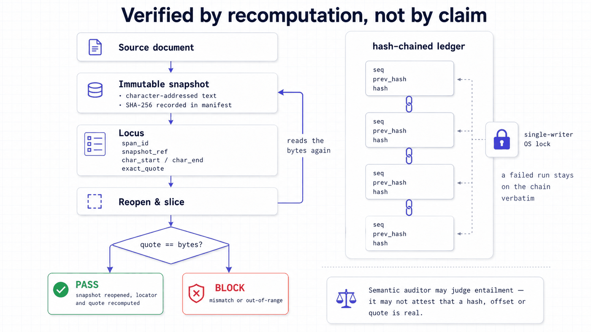

<div align="right"><a href="README.zh-CN.md">简体中文</a></div>

<p align="center"></p>

<p align="center">
  
  
  
  
  
</p>

Research Agent Teams is an auditable multi-agent research orchestration system. It coordinates AI agents through a real research workflow — from discovery to a written report — without losing traceability or human control. Evidence stays auditable end to end: citation attribution recomputes every claim-to-source span from a local, immutable snapshot, and each run is recorded in a hash-chained, append-only ledger. Designed and built end to end by **Ruixuan Liao**.

<p align="center">
  <a href="#-quick-start">Quick start</a> ·
  <a href="#-what-a-run-produces">What a run produces</a> ·
  <a href="#-the-seven-stages">The pipeline</a> ·
  <a href="#-evidence-and-audit">Evidence and audit</a> ·
  <a href="#-documentation">Documentation</a>
</p>

## 🧭 Overview

**Problem.** Multi-agent systems are good at producing research-shaped output and bad at producing research. A pipeline of agents will hand you a manuscript with citations, and you have no way to check whether any given sentence is actually supported by the source it names, whether the run that produced a number was the run that reported it, or whether the model quietly bet on its own idea. Self-reported confidence is not evidence, and a plausible artifact is the most expensive kind of wrong.

**Solution.** This system refuses to trust self-claims anywhere it matters. A locus is only verified by **reopening an immutable snapshot** and slicing the exact character range to confirm the quoted text is really there — the semantic auditor may judge entailment, but it may not attest that a hash, offset or quote is real. Every artifact is validated against a JSON-Schema contract twice, once by the producer and again at the stage boundary, with a pre-write hook that blocks an invalid artifact before it lands. Every run appends to a hash-chained ledger under an OS-level single-writer lock. Five human gates sit at the decisions a model must not make alone, arranged so the model structurally cannot bet on its own ideas. And nothing reaches the knowledge vault except through a promotion gate that **re-derives** status from the referenced audits and ignores whatever the candidate claims about itself.

**Scope.** This is personal research infrastructure — a control plane, contracts, deterministic tools, and the test suite that enforces them. It is not a hosted product and not a general-purpose agent framework. It ships no bundled end-to-end example, no LICENSE has been chosen yet, and the checkout directory has to be named `research_agent_teams` for imports to resolve. The fastest way in is the test suite together with the architecture documents.

## ✨ Highlights

- **Traceable by construction** — citation attribution recomputes every claim-to-source span from a local, immutable full-text snapshot with a recorded SHA-256, and **blocks** when the quoted text does not match the bytes at the recorded offsets.
- **Tamper-evident record** — a hash-chained, append-only ledger where each event links to its predecessor, written under an OS-level exclusive lock so two processes cannot fork the chain.
- **Humans hold the pen** — 5 human decision gates covering idea selection, venue choice, the publish decision and vault promotion, arranged so the model structurally cannot bet on its own ideas.
- **Double-validated artifacts** — 170 JSON-Schema contracts, enforced by the producer, again at the stage boundary, and a third time by a pre-write hook that fails closed on any internal error.
- **Fenced agents** — a permission-scope guard confines each worker to its own run and stage directory; run infrastructure, other stages and the knowledge vault are unwritable by design, in both the Python core and its Node hook mirror.
- **Controlled promotion** — knowledge enters the research vault only through a gate that re-derives citability from the referenced leakage, fairness and review audits, with manual override structurally forbidden.
- **A real workflow, not a demo loop** — 7 stages, 26 modes, 166 rostered agents and 146 deterministic tools, with a step-wise resumable execution spine and bounded repair.

## 📦 What a run produces

Every mode ends in a **director-review packet** — a human-readable folder, not a chat log. Its root document (`director-review/00-REVIEW-PACKET.md`) must answer seven fixed headings, and a renderer refuses to emit it if one is missing:

> What Happened · What The Director Can Decide Now · Trust Boundary · Key Findings · Gate Trace · Evidence Index · Open Questions And Next Run

Underneath sit the five artifact families, depending on which mode ran:

| Artifact | Produced by | Contains |
| --- | --- | --- |
| **Evidence briefs** | evidence and deep-research modes | Verified sources with claim-to-span attribution |
| **Idea bets** | ideation modes | A menu of directions, each as an investment memo — the input to the human idea-bet gate |
| **Experiment plans** | design and rigor modes | Protocol, splits, unified config, and a result-readiness assessment |
| **Manuscript draft** | the authoring mode | A sectioned draft with its asset manifest and literature coverage |
| **Reviewer report** | review and venue modes | Blind reviews, a venue-readiness verdict, and the threats/contribution ledger |

Secrets are redacted on the way out, and every write is path-fenced to the run directory. The packet renderer never writes the vault.

## 🏗 Architecture

<p align="center"></p>

<p align="center"><sub>Seven pipeline stages resting on three planes: control, execution and repair, evidence and audit.</sub></p>

Runs flow through a seven-stage pipeline driven by a **control plane** that holds the orchestrator's stage graph, a registry of 26 modes and a roster of 166 agents. Execution runs on an **operated spine** — `begin → open stage → work → commit stage → report` — that is step-wise resumable and repairs within a bounded budget rather than retrying forever. Inside each stage, work follows a fixed micro-protocol (`PARSE → RECALL → WORK → VERIFY → RECORD → REVIEW → REPORT`), so "did the agent check its own work" is a structural property rather than a hope.

Everything the run emits passes through the **evidence layer**: schema contracts double-validate each artifact, citation attribution ties every claim back to a source span, and the hash-chained ledger records the run. A full pass ends in the director-review packet; moving results into the separate research vault happens only through a single gated promotion seam.

## 🔢 The seven stages

Each stage declares which agents may act, which blocking gates must pass, and the one artifact that constitutes its exit. A stage cannot end without producing its exit artifact, and that artifact cannot be written unless it validates.

| Stage | Exit artifact | Blocking gates | Produces |
| --- | --- | --- | --- |
| **DISCOVER** | `evidence_table` | evidence verifier · citation-integrity auditor | A verified source set with claim/evidence spans |
| **IDEATE** | `idea_backlog` | — | Ranked, collision-checked candidate directions |
| **DESIGN** | `experiment_matrix` | variable-control · train/test alignment · metric implementation | A protocol with splits and a unified config |
| **EXECUTE** | `run_record` | preflight · train/test parity · variable-touch guard | Scripts, runs, receipts, a reproduction package |
| **ANALYZE** | `result_summary` | result sanity checker | Extracted metrics, statistics, variance and fairness audits, figures |
| **VERIFY** | `review_report` | adversarial reviewer | Blind reviews, a venue-readiness verdict, threats and contributions |
| **REPORT** | `report_note` | — | The director-facing report note (terminal stage) |

## 🚦 The five human gates

Each gate is a director command, not something a model can invoke. They sit exactly where a wrong autonomous decision would be expensive and hard to detect afterwards:

| Gate | Where | The single decision it owns |
| --- | --- | --- |
| **Idea bet** | IDEATE | Which one idea gets pursued. The model proposes the menu; it never picks from it. |
| **Venue pick** | VERIFY | Which venue to target — the pick then instantiates that venue's review rubric. |
| **Venue decide** | VERIFY | Publish, add experiments, change methods, or pivot. |
| **Promote to vault** | after RECORD | Whether a result is allowed to become durable knowledge, re-derived from its audits. |
| **External-skill approve** | any | Whether a staged external skill may be referenced — reference-only, never executable. |

## 🔬 Evidence and audit

This is the part that makes the rest worth trusting.

**Citation attribution is mechanical, not attested.** Before verification, the full text is materialised into an immutable, character-addressed snapshot with a SHA-256 of the source bytes recorded in a sidecar manifest. Every locus must carry a span id, a snapshot reference, a parser version, an exact quote and integer character offsets. Verification then **reopens the snapshot bytes, decodes them, slices the recorded range, and compares** — a mismatch, or an out-of-range end offset, is a hard `BLOCK`. Snapshot references that escape the run directory or resolve to a symlink fail closed. Table and figure loci are verified through their own paths (cell reference, manifest-listed region asset). The semantic auditor is deliberately kept separate: it may decide whether a source *entails* a claim, but it may not attest that a hash, offset or quote is real.

<p align="center"></p>
<p align="center"><sub>A locus is verified only by reopening the snapshot and recomputing it — and the ledger that records the run is chained and single-writer.</sub></p>

**The ledger is chained and single-writer.** Each event is one JSON line whose hash covers the previous hash plus the canonical event body, so any edit to history breaks the chain from that point on. `verify_chain` reports exactly which of three things broke: sequence, linkage, or content. The read-append-write critical section is wrapped in an OS-level exclusive lock on a sidecar file (`msvcrt` on Windows, `flock` on POSIX), because two concurrent writers would otherwise read the same predecessor hash and fork the chain. A failed run stays on the chain verbatim; reopening it appends a new event carrying director authority, a reason, and a digest of every worker bundle at reopen time.

**Contracts are enforced three times.** 170 JSON-Schema contracts (Draft 2020-12) cover every artifact family — run spine, evidence and citation, paper reading, gap and ideation, design, execution, analysis, review and venue, manuscript, and promotion. The producer validates, the stage boundary validates again, and a `PreToolUse` hook validates the *proposed content* of any `.artifact.json` write before it lands, exiting non-zero to block. That hook fails **closed**: an internal error while handling a governed write also blocks, because a blocked write is retryable and an unvalidated artifact silently corrupts the contract.

**Agents are fenced.** A permission-scope guard confines a worker to `runs/<run>/evidence/<stage>/` and `runs/<run>/inbox/`. Run infrastructure (the manifest, the ledger, the lock), other runs, other stages, the projects tree and the knowledge vault are all unwritable. The rule exists twice — a Python core and a Node hook — and a parity test pins them to each other, so the runtime guard cannot drift from the reference implementation.

## 🔐 The promotion seam

The machine and the knowledge base are separate on purpose: this repository is the workshop (scratch, runs, tools, control plane); the research vault is the database, and it holds validated knowledge only. Exactly one path crosses that boundary, and it is a human command.

A promotion candidate does not carry its own verdict — it carries *references* to audits. The gate loads each referenced audit fail-closed (missing file, out-of-run path, malformed JSON or wrong schema all abort), then **re-derives** citability itself: a result is citable only when its status is `frozen` **and** the leakage audit passed **and** the fairness audit passed. Manual override is not implemented, self-claims are ignored, and `provisional` or `UNVERIFIED` results are structurally non-promotable — the machine's own ceiling for a result summary is `provisional`, and only a director-command freeze can lift it. A successful promotion appends a `promote` event to the ledger. A parallel, deliberately narrower lane admits readable documents (paper cards, syntheses, idea cards) with a SHA-verified copy of the source and explicit epistemic labels — it can never create a result or a citable claim.

## 🚀 Quick start

### Requirements

- **Python 3** with `pytest`
- The dependencies in [`requirements.txt`](requirements.txt), all exactly pinned: PyYAML, jsonschema, cryptography, PyMuPDF, paramiko
- **Node.js** only if you want to exercise the two enforcement hooks
- No GPU and no external services are needed to run the test suite

> [!IMPORTANT]
> The checkout directory **must be named `research_agent_teams`** — modules import from `research_agent_teams.*`, and a differently named folder will fail to import.

### Install and run the suite

```bash
git clone <repository> research_agent_teams
cd research_agent_teams
pip install -r requirements-dev.txt
python -m pytest tests/ -q
```

### What you should see

The full suite is large — on the order of a few thousand assertions across **245 test files** — and takes several minutes on a laptop. It is the fastest honest way to see what the system guarantees, because the guarantees *are* the tests: the ledger chain detects sequence, linkage and content tampering; citation loci fail when a quote does not match its offsets; fenced agents cannot write the vault; the Python scope guard and its Node mirror agree; promotion refuses a candidate whose audits do not support it.

**On a clean clone the suite does not come out all-green, and that is expected.** A full run here on Windows 11 / Python 3.9 gave:

```text
66 failed, 4434 passed, 26 skipped, 4 errors in 266.51s (0:04:26)
```

Every one of those failures is a missing fixture, not a broken guarantee. Eight test modules reach for a working directory under `projects/<slug>/` — `test_projects.py`, `test_resources.py`, `test_resource_resolver.py`, `test_workbench_views.py`, `test_hooks_js.py`, `test_collision_gate_integration.py`, `test_t4_example_dry_run.py`, `test_t4_native_multi_agent_evidence.py` — and `projects/` is deliberately **not** published: it held real host, IP and SSH material from the machines these runs executed on. The failure surfaces as `FileNotFoundError: ...\projects	4-scribble-m0-mechanism-eval`.

So read the number as **4,434 passing assertions over the parts that ship**, and treat the 66 as a to-do: the fixtures need synthesising before that path can be verified from a clean clone.

There is no bundled end-to-end example project either, so pair the suite with [`PLATFORM-FACTS.md`](PLATFORM-FACTS.md) — a machine-derived inventory of what actually exists today, kept deliberately separate from claims about what it can achieve.

## 🗺 Repository map

| Path | What it holds |
| --- | --- |
| [`orchestrator/`](orchestrator/) | The control plane: stage graph, mode registry, agent roster, router, engine, gate and model policy |
| [`operate/`](operate/) | The operated spine — step-wise resumable driver, per-mode recipes, panel scheduler, bounded repair |
| [`agents/`](agents/) | 166 agent specifications, one Markdown file each, plus shared rubrics and catalogues |
| [`gates/`](gates/) | The 5 human decision-gate specifications |
| [`schemas/`](schemas/) | 170 JSON-Schema artifact contracts |
| [`tools/`](tools/) | 146 deterministic Python tools — ledger, citation attribution, validators, promotion, renderers |
| [`hooks/`](hooks/) | The two Node enforcement hooks (artifact contract, permission scope) |
| [`execute/`](execute/) | The gated GPU-execution layer; the default mode builds an exact remote job offline without connecting |
| [`server_monitor/`](server_monitor/) | A read-only GPU-server monitor with its own query contract |
| [`reporting/`](reporting/) | Director-facing briefings, progress reports, outcome cards, plain-language vocabulary |
| [`profiles/`](profiles/) | 7 domain profiles plus paper design tokens |
| [`skills/`](skills/) | 6 machine skills (5 adapted from K-Dense, 1 native) |
| [`tests/`](tests/) | 245 test files — the executable specification |

## 📚 Documentation

Written standards live in [`docs/`](docs/) (in Chinese), each defining what a good output of that kind must contain:

- [`IDEA-CARD-STANDARD-CN.md`](docs/IDEA-CARD-STANDARD-CN.md) — the deep research-idea card, ordered by readability, scientific value, evidence, mechanism depth and falsifiability
- [`PAPER-READING-STANDARD-CN.md`](docs/PAPER-READING-STANDARD-CN.md) — deep paper reading and evidence-bearing notes; images optional, textual equivalents mandatory
- [`RESEARCH-PROGRESS-REPORT-STANDARD-CN.md`](docs/RESEARCH-PROGRESS-REPORT-STANDARD-CN.md) — progress reports that must state new reliable knowledge, confidence shifts, and the next most decision-changing experiment
- [`STORAGE-PIPELINE-AND-PROMOTION-CN.md`](docs/STORAGE-PIPELINE-AND-PROMOTION-CN.md) — the three-layer storage model and how promotion actually works

[`PLATFORM-FACTS.md`](PLATFORM-FACTS.md) is the machine inventory: what is operated today versus specified only, what is gated on hardware, and the deterministic verification behind those numbers.

## 🧰 Tech stack

| Layer | Choice |
| --- | --- |
| Language | Python, standard-library-first |
| Pinned dependencies | PyYAML, jsonschema, cryptography, PyMuPDF, paramiko — all exact versions |
| Contracts | JSON Schema Draft 2020-12 |
| Enforcement hooks | Two Node `PreToolUse` hooks, mirroring the Python guards |
| Persistence | Plain files: JSONL ledgers, JSON artifacts, YAML control-plane configs |
| Model access | Provider-agnostic at the orchestrator level; no vendor SDK in the core |

## 🖥 Compatibility

| Component | Support |
| --- | --- |
| Python | 3 (developed and tested against the pinned dependency set) |
| Operating systems | Windows and POSIX — the ledger lock has a native implementation for each |
| Checkout name | Must be `research_agent_teams` |
| GPU | Not needed for tests, contracts or planning; only the execute layer's live path uses one |
| Network | Not required — the default execute mode builds a remote job offline without connecting |

## 📊 Project status

- **Working and enforced** — the control plane, the operated spine, the schema contracts, the ledger, citation attribution, the scope guards, the promotion and document-admission lanes, and the director packet renderer. All of it is covered by the 245-file suite, of which **237 modules run on a clean clone** — the remaining 8 need the unpublished `projects/` fixtures (see [What you should see](#what-you-should-see)).
- **Specified but not operated** — a subset of the 26 modes are specification-only, and part of the execute layer is gated on a GPU server. `PLATFORM-FACTS.md` splits these into explicit buckets rather than blurring them.
- **Known drift** — `PLATFORM-FACTS.md` is a dated snapshot and some of its counts trail the live tree (for example it records 167 schemas where the repository now has 170). The YAML files and the tests are the source of truth; the snapshot is a record of one verification run.
- **Not here** — no bundled end-to-end example project, no CI configuration, and no LICENSE yet.

## 📌 Limitations

Personal research infrastructure, designed and built end to end by one person. It is functional and exercised by its test suite, with three practical caveats worth knowing before you clone it: the checkout directory must be named `research_agent_teams`; no bundled end-to-end example ships here, so the tests plus the architecture docs are the entry point; and `machine_clean`, the system's own health verdict, is a statement about the machine's internal consistency — **it is not a scientific claim** about any result the machine helped produce.

## 🙋 Getting help

- **Start with** the test suite and [`PLATFORM-FACTS.md`](PLATFORM-FACTS.md) — between them they describe what exists and what it guarantees.
- **Import errors** are almost always the checkout directory name.
- **Bugs** — open a GitHub issue with your Python version, the failing test, and the full traceback.

## 🙏 Acknowledgements

Five of the six machine skills in [`skills/`](skills/) are adapted from the MIT-licensed K-Dense *scientific-agent-skills* collection, with attribution recorded in each adapted file; the sixth is native to this project.

## 📄 License

No LICENSE file ships in this repository, so the terms of use are **not yet defined** — treat the code as all rights reserved until one is added. Adapted third-party skills retain their upstream MIT terms, credited in place.

<p align="center"><sub>Built by <a href="https://github.com/SensLiao">Ruixuan "Sens" Liao</a> · USYD Advanced Computing (Honours)</sub></p>
