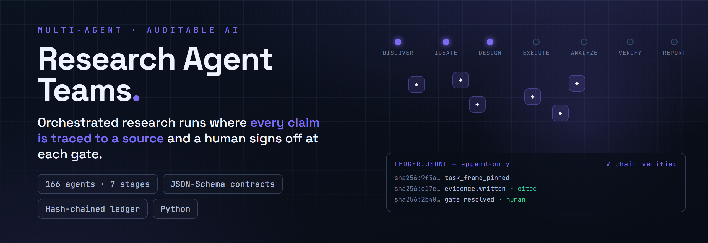
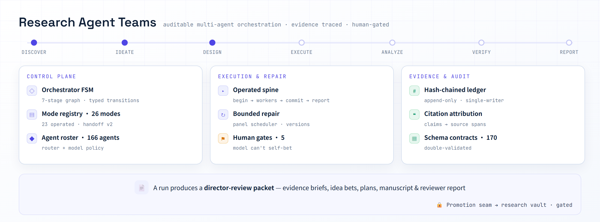

<div align="right"><a href="README.md">English</a></div>

<p align="center"></p>

<p align="center">
  
  
  
  
  
</p>

Research Agent Teams 是一个可审计的多智能体科研编排系统。它协调 AI 智能体走完一条真实的研究工作流——从发现到成文报告——而不丢失可溯源性与人的控制权。证据端到端保持可审计：引用归因会从本地不可变快照中重新计算每一条"主张→来源片段"的对应关系，每次运行都被记录进一条哈希链式、只追加的账本。由 **Ruixuan Liao** 端到端设计与实现。

<p align="center">
  <a href="#-快速开始">快速开始</a> ·
  <a href="#-一次运行产出什么">一次运行的产出</a> ·
  <a href="#-七个阶段">管线</a> ·
  <a href="#-证据与审计">证据与审计</a> ·
  <a href="#-文档">文档</a>
</p>

## 🧭 概览

**问题。** 多智能体系统擅长产出"长得像研究的东西"，不擅长产出研究。一条智能体流水线会递给你一份带引用的手稿，而你没有办法核实：任何一句话是否真的被它所引的来源支持、产出某个数字的那次运行是否就是汇报它的那次运行、模型是否悄悄押注了自己提出的想法。自报的置信度不是证据，而一个看起来合理的产物是最昂贵的那种错误。

**方案。** 这个系统在所有要紧的地方都拒绝相信自报结论。一处引用位点只有通过**重新打开不可变快照**、切出确切字符区间、确认引文确实在那里，才算被验证——语义审计者可以判断蕴含关系，但无权证明某个哈希、偏移或引文是真的。每份产物都要对照 JSON-Schema 契约验证两次，生产端一次、阶段边界一次，再加一个写入前的钩子，在非法产物落盘之前就拦下它。每次运行都在操作系统级单写者锁的保护下追加到哈希链账本。5 道人类门禁守在模型不该独自决定的地方，且刻意布置成模型在结构上无法押注自己的想法。任何东西进入知识库都必须经过一道晋升门禁，而它会从被引用的审计里**重新推导**结论，无视候选者对自己的任何声称。

**范围。** 这是个人科研基础设施——一个控制平面、一批契约、一批确定性工具，以及强制执行它们的测试套件。它不是托管产品，也不是通用智能体框架。仓库不附带端到端示例，尚未选定 LICENSE，并且检出目录必须命名为 `research_agent_teams` 才能正确导入。最快的入口是测试套件加架构文档。

## ✨ 亮点

- **构造性可溯源** — 引用归因从带 SHA-256 记录的本地不可变全文快照中重新计算每一条"主张→来源片段"，当引文与记录偏移处的字节不符时直接**拦截**。
- **防篡改记录** — 哈希链式、只追加的账本，每个事件都链回前驱，并在操作系统级排他锁下写入，因此两个进程不可能把链分叉。
- **人握着笔** — 5 道人类决策门禁，覆盖选题下注、期刊选择、发表决策与入库晋升，且布置成模型在结构上无法押注自己的想法。
- **双重校验的产物** — 170 份 JSON-Schema 契约，由生产端执行一次、阶段边界再执行一次，第三次由一个写入前钩子执行，且该钩子遇到内部错误时按"拦截"处理。
- **被围栏的智能体** — 权限范围守卫把每个 worker 限制在它自己的运行与阶段目录内；运行基础设施、其他阶段与知识库在设计上不可写，这条规则在 Python 内核与 Node 钩子中各存在一份。
- **受控的晋升** — 知识只能经由一道门禁进入研究知识库，该门禁从被引用的泄漏审计、公平性审计与评审结论中重新推导可引用性，且在结构上不提供人工覆盖。
- **真实工作流，不是演示回路** — 7 个阶段、26 种模式、166 个在册智能体、146 个确定性工具，配一条可分步续跑的执行主干与有界修复。

## 📦 一次运行产出什么

每种模式最终都产出一个**导师评审包**——一个人类可读的文件夹，而不是聊天记录。它的根文档（`director-review/00-REVIEW-PACKET.md`）必须回答七个固定小标题，缺一个渲染器就拒绝产出：

> 发生了什么 · 导师现在能决定什么 · 信任边界 · 关键发现 · 门禁轨迹 · 证据索引 · 开放问题与下一次运行

其下是五类产物，取决于运行的是哪种模式：

| 产物 | 由谁产出 | 内容 |
| --- | --- | --- |
| **证据简报** | 证据类与深度研究模式 | 经核验的来源，附"主张→片段"归因 |
| **选题下注** | 构思类模式 | 一份方向菜单，每个方向写成投资备忘录——人类选题门禁的输入 |
| **实验方案** | 设计与严谨性模式 | 协议、数据切分、统一配置，以及结果就绪度评估 |
| **手稿草稿** | 撰写模式 | 分节草稿，附资产清单与文献覆盖情况 |
| **评审报告** | 评审与期刊模式 | 盲审意见、投稿就绪判定，以及威胁与贡献台账 |

产出路径上会做密钥模式脱敏，每次写入都被路径围栏限制在运行目录内。评审包渲染器从不写知识库。

## 🏗 架构

<p align="center"></p>

<p align="center"><sub>七个管线阶段，坐落在三个平面之上：控制平面，执行与修复平面，证据与审计平面。</sub></p>

运行流经一条七阶段管线，由**控制平面**驱动——它持有编排器的阶段图、一份 26 种模式的注册表与一份 166 个智能体的名册。执行跑在一条**受操作的主干**上——`begin → 开启阶段 → 工作 → 提交阶段 → 汇报`——可分步续跑，并在有界预算内修复，而不是无限重试。每个阶段内部，工作遵循固定的微协议（`PARSE → RECALL → WORK → VERIFY → RECORD → REVIEW → REPORT`），因此"智能体有没有检查自己的工作"是一个结构性属性，而不是一种指望。

运行发出的一切都经过**证据层**：schema 契约对每份产物双重校验，引用归因把每条主张系回来源片段，哈希链账本记录整次运行。一次完整流程终于导师评审包；把结果搬进独立的研究知识库，只能经由唯一一道带门禁的晋升缝隙。

## 🔢 七个阶段

每个阶段都声明哪些智能体可以行动、哪些阻塞门禁必须通过，以及构成其出口的那一份产物。阶段不产出出口产物就不能结束，而该产物不通过校验就无法写入。

| 阶段 | 出口产物 | 阻塞门禁 | 产出 |
| --- | --- | --- | --- |
| **DISCOVER** | `evidence_table` | 证据核验者 · 引用完整性审计者 | 带主张/证据片段的已核验来源集 |
| **IDEATE** | `idea_backlog` | — | 经排序与撞车检查的候选方向 |
| **DESIGN** | `experiment_matrix` | 变量控制 · 训练/测试对齐 · 指标实现 | 带切分与统一配置的实验协议 |
| **EXECUTE** | `run_record` | 预检 · 训练/测试一致性 · 变量触碰守卫 | 脚本、运行、回执、复现包 |
| **ANALYZE** | `result_summary` | 结果合理性检查者 | 抽取的指标、统计、方差与公平性审计、图表 |
| **VERIFY** | `review_report` | 对抗性评审者 | 盲审意见、投稿就绪判定、威胁与贡献 |
| **REPORT** | `report_note` | — | 面向导师的报告说明（终态阶段） |

## 🚦 五道人类门禁

每道门禁都是导师命令，模型无法调用。它们恰好守在"自动决策一旦出错就代价高昂且事后难以察觉"的位置：

| 门禁 | 位置 | 它独占的那一个决定 |
| --- | --- | --- |
| **选题下注** | IDEATE | 到底追哪一个想法。模型提出菜单，但从不自己点单。 |
| **期刊选择** | VERIFY | 目标投稿去向——该选择随后实例化对应期刊的评审量表。 |
| **发表决策** | VERIFY | 投稿、补实验、改方法，还是转向。 |
| **入库晋升** | RECORD 之后 | 某个结果是否被允许成为持久知识，由其审计重新推导。 |
| **外部技能批准** | 任意位置 | 某个暂存的外部技能是否可被引用——只读引用，永不可执行。 |

## 🔬 证据与审计

这是让其余部分值得信任的那一部分。

**引用归因是机械核验，而非采信声明。** 在核验之前，全文会被物化成一份不可变的、按字符定址的快照，并在旁挂清单中记录源字节的 SHA-256。每个位点都必须携带 span id、快照引用、解析器版本、确切引文与整数字符偏移。核验时**重新打开快照字节、解码、切出记录区间并逐字比对**——不匹配、或结束偏移越界，都是硬性 `BLOCK`。逃出运行目录或指向符号链接的快照引用一律按失败处理。表格与图像位点各有自己的核验路径（单元格引用、清单登记的区域资产）。语义审计者被刻意隔离：它可以判断来源是否*蕴含*某条主张，但无权证明某个哈希、偏移或引文是真的。

<!-- image-slot: docs/evidence-chain.png — 一条主张如何被核验：不可变快照 + SHA-256、字符偏移、重新打开比对、不符则 BLOCK；旁边是哈希链账本 -->

**账本是链式且单写者的。** 每个事件是一行 JSON，其哈希覆盖前驱哈希加规范化的事件体，因此对历史的任何改动都会从该点起断链。`verify_chain` 会明确报告三者中哪一项被破坏：序号、链接，还是内容。"读—追加—写"的临界区被包在一个旁挂文件的操作系统级排他锁中（Windows 用 `msvcrt`，POSIX 用 `flock`），因为两个并发写者会读到同一个前驱哈希并把链分叉。失败的运行原样留在链上；重新开启它会追加一个新事件，携带导师授权、原因，以及重开时刻全部 worker 产物包的摘要。

**契约被强制三次。** 170 份 JSON-Schema 契约（Draft 2020-12）覆盖每个产物家族——运行主干、证据与引用、论文精读、缺口与构思、设计、执行、分析、评审与期刊、手稿、晋升。生产端校验一次，阶段边界再校验一次，还有一个 `PreToolUse` 钩子在任何 `.artifact.json` 写入落盘之前校验其*拟写入内容*，不通过则以非零退出码拦截。该钩子按"失败即拦截"设计：处理受治理写入时发生内部错误也一律拦截，因为被拦截的写入可以重试，而未经校验的产物会悄无声息地污染契约。

**智能体被围栏。** 权限范围守卫把 worker 限制在 `runs/<run>/evidence/<stage>/` 与 `runs/<run>/inbox/` 之内。运行基础设施（清单、账本、锁）、其他运行、其他阶段、项目树与知识库全部不可写。这条规则存在两份——一份 Python 内核、一份 Node 钩子——并由一个一致性测试把两者钉死，因此运行时守卫不会与参考实现产生漂移。

## 🔐 晋升缝隙

机器与知识库刻意分离：本仓库是车间（草稿、运行、工具、控制平面），研究知识库是数据库，只存放经过验证的知识。跨越这条边界的路径只有一条，而且是一条人类命令。

晋升候选者并不携带自己的结论——它携带指向审计的*引用*。门禁以"失败即拒绝"的方式加载每一份被引用的审计（文件缺失、路径逃出运行目录、JSON 畸形或 schema 不符都会中止），然后**自行重新推导**可引用性：只有当结果状态为 `frozen`、**且**泄漏审计通过、**且**公平性审计通过时，该结果才可被引用。人工覆盖没有实现，自报结论被忽略，`provisional` 或 `UNVERIFIED` 的结果在结构上不可晋升——机器自己给结果摘要设的上限就是 `provisional`，只有导师命令的冻结操作才能重新推导出 `frozen`。晋升成功会向账本追加一个 `promote` 事件。另有一条刻意更窄的并行通道，用于收录可读文档（论文卡、综述、想法卡），要求附带经 SHA 校验的源件副本与明确的认识论标签——它永远无法创建结果或可引用主张。

## 🚀 快速开始

### 环境要求

- **Python 3** 与 `pytest`
- [`requirements.txt`](requirements.txt) 中的依赖，全部精确锁版本：PyYAML、jsonschema、cryptography、PyMuPDF、paramiko
- **Node.js** 仅在你想执行那两个强制钩子时需要
- 跑测试套件不需要 GPU，也不需要任何外部服务

> [!IMPORTANT]
> 检出目录**必须命名为 `research_agent_teams`** —— 模块从 `research_agent_teams.*` 导入，目录名不同将导致导入失败。

### 安装并运行测试套件

```bash
git clone <repository> research_agent_teams
cd research_agent_teams
pip install -r requirements-dev.txt
python -m pytest tests/ -q
```

### 预期效果

整套测试规模不小——**245 个测试文件**中包含数千条断言——在笔记本上需要数分钟。它是理解本系统承诺了什么的最快且最诚实的途径，因为那些承诺*就是*这些测试：账本链能检出序号、链接与内容三类篡改；引文与偏移不符时位点核验失败；被围栏的智能体写不了知识库；Python 范围守卫与它的 Node 镜像互相一致；当审计不支持时晋升会被拒绝。

仓库不附带端到端示例项目，因此请把测试套件与 [`PLATFORM-FACTS.md`](PLATFORM-FACTS.md) 搭配阅读——后者是一份由机器推导出的"今天究竟存在什么"的清单，与"它能达成什么"的主张被刻意分开。

## 🗺 仓库地图

| 路径 | 内容 |
| --- | --- |
| [`orchestrator/`](orchestrator/) | 控制平面：阶段图、模式注册表、智能体名册、路由器、引擎、门禁与模型策略 |
| [`operate/`](operate/) | 受操作的主干——可分步续跑的驱动器、逐模式配方、面板调度器、有界修复 |
| [`agents/`](agents/) | 166 份智能体规格，每个一个 Markdown 文件，另有共享量表与目录 |
| [`gates/`](gates/) | 5 份人类决策门禁规格 |
| [`schemas/`](schemas/) | 170 份 JSON-Schema 产物契约 |
| [`tools/`](tools/) | 146 个确定性 Python 工具——账本、引用归因、校验器、晋升、渲染器 |
| [`hooks/`](hooks/) | 两个 Node 强制钩子（产物契约、权限范围） |
| [`execute/`](execute/) | 带门禁的 GPU 执行层；默认模式在离线状态下构建精确的远程作业而不建立连接 |
| [`server_monitor/`](server_monitor/) | 只读 GPU 服务器监控，带自己的查询契约 |
| [`reporting/`](reporting/) | 面向导师的任务前简报、进度报告、结果卡、平实语言词表 |
| [`profiles/`](profiles/) | 7 份领域画像，以及论文设计令牌 |
| [`skills/`](skills/) | 6 个机器技能（5 个改编自 K-Dense，1 个原生） |
| [`tests/`](tests/) | 245 个测试文件——可执行的规范 |

## 📚 文档

书面标准位于 [`docs/`](docs/)（中文），每一份都定义了该类产出必须包含什么：

- [`IDEA-CARD-STANDARD-CN.md`](docs/IDEA-CARD-STANDARD-CN.md) — 深度研究想法卡标准，按可读性、科学价值、证据、机制深度与可证伪性排序
- [`PAPER-READING-STANDARD-CN.md`](docs/PAPER-READING-STANDARD-CN.md) — 深度论文精读与带证据的笔记；配图可选，文字等价物必需
- [`RESEARCH-PROGRESS-REPORT-STANDARD-CN.md`](docs/RESEARCH-PROGRESS-REPORT-STANDARD-CN.md) — 进度报告必须说明新获得的可靠知识、置信度变化，以及下一个最能改变决策的实验
- [`STORAGE-PIPELINE-AND-PROMOTION-CN.md`](docs/STORAGE-PIPELINE-AND-PROMOTION-CN.md) — 三层存储模型与晋升的实际运作方式

[`PLATFORM-FACTS.md`](PLATFORM-FACTS.md) 是机器清单：今天哪些已被操作、哪些仅有规格、哪些受硬件门控，以及支撑这些数字的确定性验证过程。

## 🧰 技术栈

| 层 | 选择 |
| --- | --- |
| 语言 | Python，标准库优先 |
| 锁定依赖 | PyYAML、jsonschema、cryptography、PyMuPDF、paramiko——全部精确版本 |
| 契约 | JSON Schema Draft 2020-12 |
| 强制钩子 | 两个 Node `PreToolUse` 钩子，与 Python 守卫互为镜像 |
| 持久化 | 纯文件：JSONL 账本、JSON 产物、YAML 控制平面配置 |
| 模型接入 | 编排层面对模型提供方无绑定；内核中不含任何厂商 SDK |

## 🖥 兼容性

| 组件 | 支持情况 |
| --- | --- |
| Python | 3（在锁定依赖集上开发与测试） |
| 操作系统 | Windows 与 POSIX——账本锁对两者各有原生实现 |
| 检出目录名 | 必须为 `research_agent_teams` |
| GPU | 测试、契约与规划均不需要；仅执行层的实跑路径使用 |
| 网络 | 不需要——默认执行模式在离线状态下构建远程作业 |

## 📊 项目状态

- **已运作并被强制** — 控制平面、受操作的主干、schema 契约、账本、引用归因、范围守卫、晋升与文档收录两条通道，以及导师评审包渲染器。以上全部被那 245 个测试文件覆盖。
- **有规格但未运作** — 26 种模式中有一部分仅有规格，执行层的一部分受 GPU 服务器门控。`PLATFORM-FACTS.md` 把它们分成明确的桶，而不是含混带过。
- **已知漂移** — `PLATFORM-FACTS.md` 是有日期的快照，其中部分计数落后于当前代码树（例如它记录 167 份 schema，而仓库现在是 170 份）。YAML 文件与测试是事实源；该快照是一次验证运行的记录。
- **不在这里** — 没有随附的端到端示例项目，没有 CI 配置，也还没有 LICENSE。

## 📌 限制

个人科研基础设施，由一人端到端设计与实现。它可用，并由测试套件持续检验，但克隆之前有三点值得知道：检出目录必须命名为 `research_agent_teams`；仓库不附带端到端示例，因此测试加架构文档才是入口；以及系统自己的健康判定 `machine_clean` 说的是机器内部一致性——**它不是**关于机器所协助产出的任何结果的科学主张。

## 🙋 获取帮助

- **先看** 测试套件与 [`PLATFORM-FACTS.md`](PLATFORM-FACTS.md)——两者合起来描述了存在什么、以及它保证什么。
- **导入报错** 几乎总是检出目录名的问题。
- **Bug** — 提交 GitHub issue，附上 Python 版本、失败的测试与完整回溯。

## 🙏 致谢

[`skills/`](skills/) 中 6 个机器技能里有 5 个改编自 MIT 许可的 K-Dense *scientific-agent-skills* 集合，署名记录在每个改编文件内；第六个为本项目原生。

## 📄 许可证

本仓库不含 LICENSE 文件，因此使用条款**尚未确定**——在补上之前，请按保留所有权利对待。改编的第三方技能保留其上游 MIT 条款，并在原处署名。

<p align="center"><sub>由 <a href="https://github.com/SensLiao">Ruixuan "Sens" Liao</a> 构建 · 悉尼大学 Advanced Computing（Honours）</sub></p>
